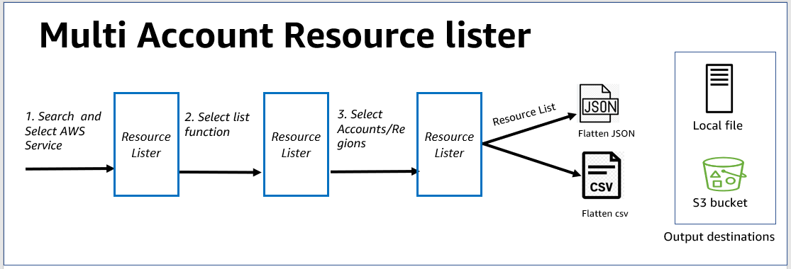
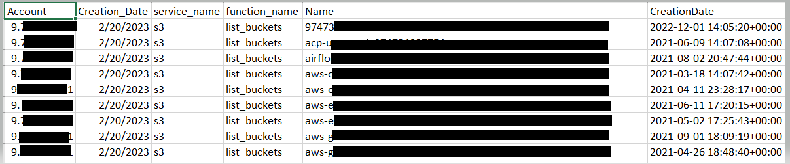
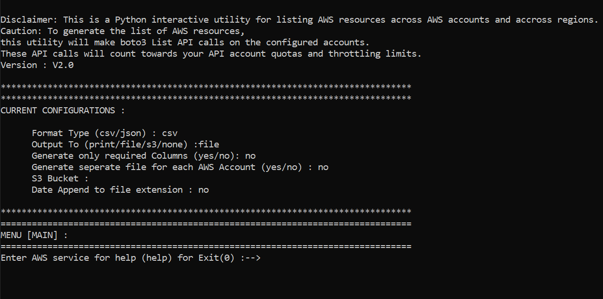
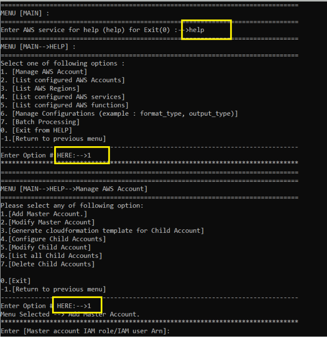
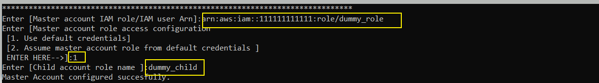
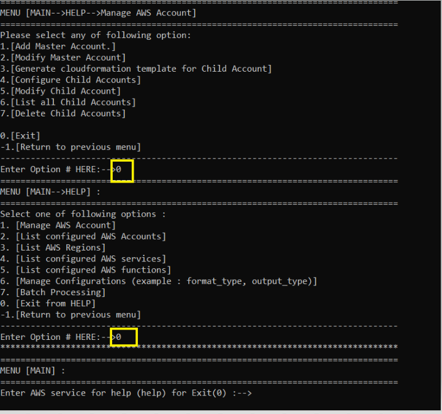
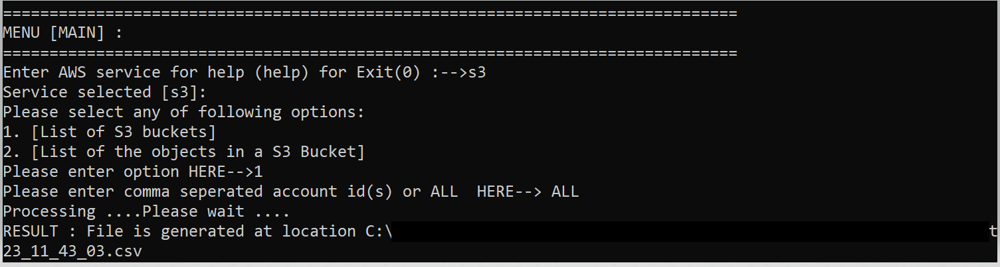

#  Resource Lister (Multi Accounts) 
Resource Lister is an open source, **NO CODE**, interactive, python-based command line utility. Resource Lister can generate **centralized**list of AWS resources (for **supported services**) in single or multiple accounts in consumable CSV, or flatten JSON format. Resource Lister uses AWS SDK for Python(Boto3) sessions and underlying Boto3 List APIs to connect multiple configured child accounts and generate the  resource list. It essentially **simplifies** accessing of Boto3 list APIs. Resource Lister also provides an option to send generated list to  file,  s3, or print on command line.
Resource Lister can be configured to run from Cloud9, Cloudshell, EC2 or from your machine.

# Usage: 

Resource Lister Utility can be helpful to addresses following usecase

* Resource Lister is handy utility for Developers, Solution Architect, Account Owners, Cloud Ops team or anyone who simply wants to generate list of AWS Resources (for **supported services**) across accounts and across regions without writing any custom code. 

* Utility can help generate list of inventory of AWS resources across region and across accounts in near real time. For example, operation team wants to verify there is no lambda function created in restricted regions in near real time. You can also run the utility in batch mode across all the configured AWS services and create inventory.

* Utility can help enforce budgetary constraints. For example, utility can help Account owners to identify which AWS accounts doesn't have AWS budget setup.

* Utility can help identify particular type of list of resources.
for example, you can generate list of lambda function and filter lambda function using python 2.6 version.

* Utility flattens the response in consumable csv format.


# How it works?

<p align="center">
  

After you install and configure the Resource Lister you can run the Resource lister utility using pipx run.

```
pipx run resource_lister
```


**1** .  **Select AWS Service** : Resource Lister Utility will prompt you to select the AWS Service: You can select any of 27 services example S3, lambda or ec2

**2** .  **Select Function**: Resource Lister Utility will display number of supported functions for selected AWS service: Example List of S3 buckets or List of Aurora DB clusters or List of Lambda functions depending upon service you selected.

**3** . **Select Account(s)**: Resource Lister Utility will prompt you to select AWS Account for which you want to generate list of AWS resources:  You can enter ALL to select all the accounts or you can enter single account or comma separated list of accounts. If you don’t know the account number you just press ENTER and utility will prompt you with list of configured accounts. 

**4** . **Select Region(s) for Regional services**: If it's regional resource (example Lambda) you will prompt to select AWS Region; you can select ALL for all the regions or specify comma separated list of regions

**5** . **Result**: Resource lister utility will then generates the list of AWS Resources for selected accounts and regions send the output to file or S3 Bucket or print on command prompt depending upon your configuration.

<p align="center">
  

**Output**
<p align="center">
  


**Note** : You can also run the utility in batch mode across all the services in selected AWS Account by going to help --> option # 6


# Prerequisite
1. [Python](https://www.python.org/)
2. [AWS CLI](https://aws.amazon.com/cli/)

# Installation

You can install and run **Resource lister** using [pipx](https://pypa.github.io/pipx/)

**On macOS, Linux, install via pip (requires pip 19.0 or later)**
```
python3 -m pip install  pipx
python3 -m pip install  boto3
python3 -m pipx install resource-lister
```
**On Windows, install via pip (requires pip 19.0 or later)**

If you installed python using the app-store, replace `python` with `python3` in the next line.
```
python -m pip install pipx
python -m pip install boto3
python -m pipx install resource-lister
```

**Run the Resource Lister Utility using pipx**

**On macOS, Linux, install via pip (requires pip 19.0 or later)**
```
python3 -m pipx run resource_lister
```
**On Windows, install via pip (requires pip 19.0 or later)**

```
python -m pipx run resource_lister
```

Resource lister utility will open in command prompt

<p align="center">
  

# Setup
<details>

  <summary>
  <b>Express setup for single account using default credentials. </b>
  </summary>
You will use default IAM credentials for this setup. Ensure your current default credentials should have <b>read only permissions</b> 


<b>Step1 : Navigate to  "Add Master Account"  </b>

Type <b>help</b>--><b>1</b> [Manage AWS Account]--><b>1</b> [Add Master Account.]

<p align="center">
  


<b>Step2 : Configure Master account with dummy values </b>

Since express setup we are using default credentials. Use dummy values for Master Account ARN like **arn:aws:iam::<Your 12 Digit Account>:role/dummy_role** and for child account role name enter **dummy_role**


<p align="center">
  

<b>Congratulations! AWS Account is successfully configured. </b>

<b>Step3: Navigate back to main search </b>


Type 0 to exit
<b>0</b>--><b>0</b>

<p align="center">
  


<b>Step4 : Test Utility by generating list of s3 buckets .csv file  </b>

Enter AWS service for help (help) for Exit (0) :--><b>s3</b>

Please select any of following options:
1. [List of S3 buckets]
2. [List of the objects in a S3 Bucket]
Please enter option HERE--><b>1</b>

Please enter comma separated account id(s) or ALL  HERE--><b>ALL</b>


<p align="center">
  

Utility will create output folder and generate the .csv file with list of s3 buckets in your account.

<p align="center">
  


  </details>


<details> 
<summary>
<b>Multi Account configurations.
</b>
</summary>


- [Cloud9 setup](https://github.com/awslabs/resource-lister/blob/main/docs/cloud_9_setup.md)

- [Cloudshell setup](https://github.com/awslabs/resource-lister/blob/main/docs/cloudshell_setup.md)


</details>

# Help
[General help](https://github.com/awslabs/resource-lister/blob/main/docs/help_guide.md)

# Supported Services and Functionality
<details> 
<summary>
<b> Supported Services and Functionality  </b>
</summary>
</details>
<table>
<tbody>
<tr>
<th>Service</th>
<th>Functions</th>
</tr>
<tr>
<td> accessanalyzer</td>
<td>
<ul>
<li>1.list_analyzers</li>
<li>2.list_findings</li>
<li>3.list_findings_v2</li>
</ul>
</td>
</tr>
<tr>
<td> account</td>
<td>
<ul>
<li>4.list_regions</li>
</ul>
</td>
</tr>
<tr>
<td> acm</td>
<td>
<ul>
<li>5.list_certificates</li>
</ul>
</td>
</tr>
<tr>
<td> amp</td>
<td>
<ul>
<li>6.list_scrapers</li>
<li>7.list_workspaces</li>
</ul>
</td>
</tr>
<tr>
<td> apigateway</td>
<td>
<ul>
<li>8.get_rest_apis</li>
</ul>
</td>
</tr>
<tr>
<td> appflow</td>
<td>
<ul>
<li>9.list_connectors</li>
</ul>
</td>
</tr>
<tr>
<td> budgets</td>
<td>
<ul>
<li>10.describe_budgets</li>
</ul>
</td>
</tr>
<tr>
<td> cleanrooms</td>
<td>
<ul>
<li>11.list_collaborations</li>
</ul>
</td>
</tr>
<tr>
<td> cloudformation</td>
<td>
<ul>
<li>12.list_stacks</li>
<li>13.list_stack_sets</li>
</ul>
</td>
</tr>
<tr>
<td> cloudfront</td>
<td>
<ul>
<li>14.list_distributions</li>
<li>15.list_functions</li>
</ul>
</td>
</tr>
<tr>
<td> cloudtrail</td>
<td>
<ul>
<li>16.list_trails</li>
</ul>
</td>
</tr>
<tr>
<td> cloudwatch</td>
<td>
<ul>
<li>17.list_dashboards</li>
<li>18.list_metrics</li>
</ul>
</td>
</tr>
<tr>
<td> codecommit</td>
<td>
<ul>
<li>19.list_repositories</li>
</ul>
</td>
</tr>
<tr>
<td> dynamodb</td>
<td>
<ul>
<li>20.list_tables</li>
</ul>
</td>
</tr>
<tr>
<td> ec2</td>
<td>
<ul>
<li>21.describe_addresses</li>
<li>22.describe_flow_logs</li>
<li>23.describe_instances</li>
<li>24.describe_network_acls</li>
<li>25.describe_route_tables</li>
<li>26.describe_security_groups</li>
<li>27.describe_security_group_rules</li>
<li>28.describe_snapshots</li>
<li>29.describe_subnets</li>
<li>30.describe_transit_gateways</li>
<li>31.describe_volumes</li>
<li>32.describe_vpcs</li>
<li>33.describe_vpc_endpoints</li>
<li>34.describe_vpc_peering_connections</li>
<li>35.describe_vpn_connections</li>
</ul>
</td>
</tr>
<tr>
<td> ecs</td>
<td>
<ul>
<li>36.list_clusters</li>
<li>37.list_services</li>
<li>38.list_tasks</li>
</ul>
</td>
</tr>
<tr>
<td> efs</td>
<td>
<ul>
<li>39.describe_file_systems</li>
</ul>
</td>
</tr>
<tr>
<td> eks</td>
<td>
<ul>
<li>40.describe_cluster</li>
<li>41.list_clusters</li>
<li>42.list_fargate_profiles</li>
</ul>
</td>
</tr>
<tr>
<td> elasticache</td>
<td>
<ul>
<li>43.describe_cache_clusters</li>
</ul>
</td>
</tr>
<tr>
<td> elbv2</td>
<td>
<ul>
<li>44.describe_load_balancers</li>
</ul>
</td>
</tr>
<tr>
<td> emr</td>
<td>
<ul>
<li>45.list_clusters</li>
<li>46.list_instance_fleets</li>
<li>47.list_notebook_executions</li>
<li>48.list_studios</li>
</ul>
</td>
</tr>
<tr>
<td> emr-serverless</td>
<td>
<ul>
<li>49.list_applications</li>
<li>50.list_job_runs</li>
</ul>
</td>
</tr>
<tr>
<td> iam</td>
<td>
<ul>
<li>51.list_users</li>
<li>52.list_access_keys</li>
<li>53.list_account_aliases</li>
<li>54.list_attached_group_policies</li>
<li>55.list_attached_role_policies</li>
<li>56.list_attached_user_policies</li>
<li>57.list_group_policies</li>
<li>58.list_groups</li>
<li>59.list_policies</li>
<li>60.list_roles</li>
</ul>
</td>
</tr>
<tr>
<td> kms</td>
<td>
<ul>
<li>61.list_keys</li>
</ul>
</td>
</tr>
<tr>
<td> lambda</td>
<td>
<ul>
<li>62.list_functions</li>
<li>63.list_layers</li>
</ul>
</td>
</tr>
<tr>
<td> organizations</td>
<td>
<ul>
<li>64.list_accounts</li>
<li>65.list_policies</li>
</ul>
</td>
</tr>
<tr>
<td> rds</td>
<td>
<ul>
<li>66.describe_db_clusters</li>
<li>67.describe_db_instances</li>
<li>68.describe_db_security_groups</li>
<li>69.describe_db_snapshots</li>
<li>70.describe_global_clusters</li>
</ul>
</td>
</tr>
<tr>
<td> redshift</td>
<td>
<ul>
<li>71.describe_clusters</li>
</ul>
</td>
</tr>
<tr>
<td> redshift-serverless</td>
<td>
<ul>
<li>72.list_namespaces</li>
<li>73.list_workgroups</li>
</ul>
</td>
</tr>
<tr>
<td> resourcegroupstaggingapi</td>
<td>
<ul>
<li>74.get_resources</li>
</ul>
</td>
</tr>
<tr>
<td> route53</td>
<td>
<ul>
<li>75.list_cidr_blocks</li>
<li>76.list_hosted_zones</li>
<li>77.list_hosted_zones_by_vpc</li>
<li>78.list_vpc_association_authorizations</li>
</ul>
</td>
</tr>
<tr>
<td> route53domains</td>
<td>
<ul>
<li>79.list_domains</li>
<li>80.list_prices</li>
</ul>
</td>
</tr>
<tr>
<td> s3</td>
<td>
<ul>
<li>81.list_buckets</li>
<li>82.list_bucket_analytics_configurations</li>
<li>83.list_bucket_intelligent_tiering_configurations</li>
<li>84.list_bucket_inventory_configurations</li>
<li>85.list_bucket_metrics_configurations</li>
<li>86.list_directory_buckets</li>
<li>87.list_multipart_uploads</li>
<li>88.list_objects_v2</li>
</ul>
</td>
</tr>
<tr>
<td> sagemaker</td>
<td>
<ul>
<li>89.list_domains</li>
<li>90.list_images</li>
<li>91.list_models</li>
<li>92.list_projects</li>
<li>93.list_user_profiles</li>
</ul>
</td>
</tr>
<tr>
<td> sns</td>
<td>
<ul>
<li>94.list_subscriptions</li>
<li>95.list_topics</li>
</ul>
</td>
</tr>
<tr>
<td> sqs</td>
<td>
<ul>
<li>96.list_queues</li>
</ul>
</td>
</tr>
<tr>
<td> ssm</td>
<td>
<ul>
<li>97.describe_instance_information</li>
</ul>
</td>
</tr>
</tbody>
<table>

## Expanding Resource Lister Capabilities: Adding Support for Additional AWS Services and Functions
Resource Lister currently supports listing and describing resources for 38 common AWS services, with approximately 100 related functions. However, Boto3 provides access to over 350 AWS services with more than 3,500 functions just for listing and describing resources. This article demonstrates how Resource Lister can be easily extended to support additional AWS services beyond the 38 currently enabled. By creating a one-time configuration file per service Resource Lister will automatically detect, any of the 350+ services and 3,500+ describe/list functions in Boto3 can be added with minimal effort. This configuration file approach allows Resource Lister's capabilities to be expanded as needed to leverage all AWS services Boto3 supports.


[How to Expand the Capabilities of the Resource Lister](https://github.com/awslabs/resource-lister/blob/main/docs/new_service_config.md)


## License
This library is licensed under the Apache-2.0. See the LICENSE file.

## Considerations
* Resource-Lister makes list API calls using AWS SDK for Python(Boto3).These   list API calls will be applied to your [AWS Account List API Quotas](https://docs.aws.amazon.com/general/latest/gr/aws_service_limits.html). 

* Utiliy provide options to use existing IAM roles or to create new roles using utility provided cloudformation templates. If you decided to use utility provided cloudformation templates.  Master account cloudformation template will create **ReadonlyAccess** IAM role in master account .Child account cloudformation template will create **ReadOnlyAccess** IAM role in child account.   


* Most of the cases list generated by utility will have 99% of the attributes send back by Boto3 .Utility doesn't assure 100% attributes are covered. 

* When running utility more than 5 accounts,to avoid **memory issues**,It's recommended to generate Account wise file. Account wise file can be generated by changing configuration settting in help section . 
Help --> 6. [Manage Configurations (example : format_type, output_type)]-->5.[Modify  Seperate file for each AWS Account]-->change to **yes**

* Utility currently supports only 27 services and 70 functions. Utility is configuration driven so adding new function is easy. If you are interested in additional functions /features, please raise issue.

# Know issues/Pending items
* Improvements in error handling messages
* Help section is work in progress


