# Resource Lister: AWS Cloud 9 Setup Guide 


<details>
  <summary># Step 1: Master account and Child account Roles </summary>

## Step 1: Master account and Child account Roles 
ResourceLister utility needs ReadOnlyAccess permission to access AWS python SDK List APIs in your Master account and child accounts.  You need to configure utility for **Master Account IAM Role ARN** and **Child account role name** as part of Master account setup (Step4 ).  For Master account and child account roles you can choose any of following options.

Option 1: Re use existing Master and Child account IAM roles.

Option 2: Create Master and Child account IAM roles using Cloudformation templates provided by utility. 

Following are considerations for using existing IAM roles vs utility provided cloudformation templates to create new IAM Roles.
<p align="center">
  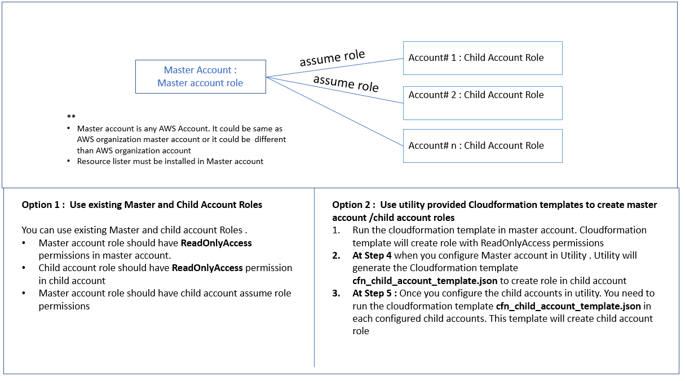


**Option 1:  Re use existing Master and Child account IAM roles** 

If you already have Master and child accounts IAM role setup, you can re-use the existing Master account role and Child account role. 
For Cloud9 setup your existing Master account IAM role should have Cloud9 Permission. You can attach following managed policy to existing Master Account IAM Role to get Cloud9 permissions.

1. AWSCloud9EnvironmentMember
2. ReadOnlyAccess
3. AWSCloud9User
4. AWSCloud9SSMInstanceProfile
5. AWSCloud9Administrator

**Option 2: Create Master and Child account IAM roles using Cloudformation templates provided by utility**

Download the **master_account_IAM_role.json** CloudFormation template from github

https://github.com/awslabs/resource-lister/blob/main/cfn/master_account_IAM_role.json

Go to CloudFormation service and create stack with new resources using downloaded template.

<p align="center">
  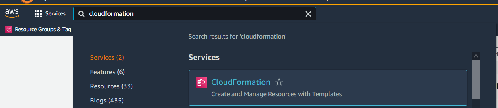

<p align="center">
  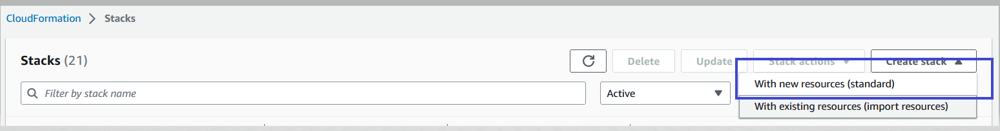

Create IAM Role in Master account by running the CloudFormation stack


Enter Stack Name: 
MasterAccountRoleName:  IAM role with this name will be created in master account. Utility will use this role to assume child account roles

ChildAccountRoleName: Master account role will have permission to assume this role.


<p align="center">
  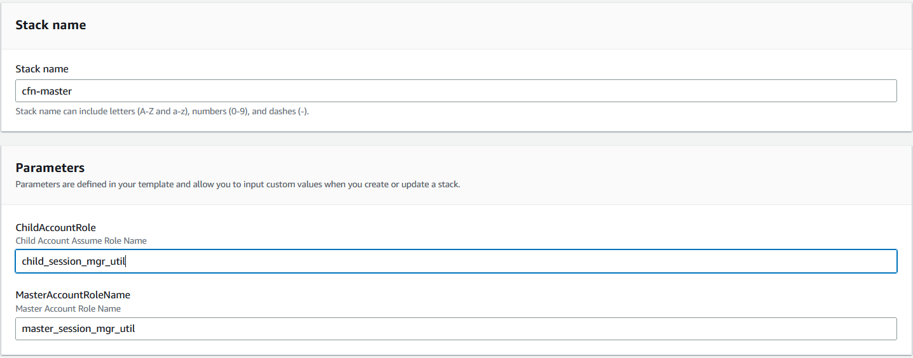

Keep all other values as default and click Next, Next and submit.

CloudFormation stack will be created. Go to output section of Cloudformation stack and copy the values for ChildAccountRoleOut and MasterAccountRole out these values will be required in Step4 when you configure utility for Master account

<p align="center">
  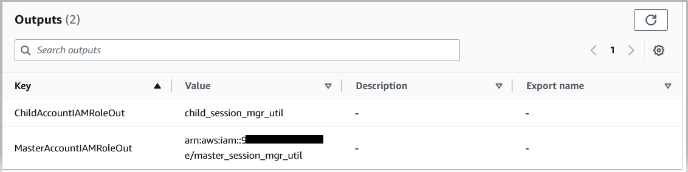

</details>

<details>

  <summary># Step 2:  Setup Cloud9 Environment </summary>


## Step 2:  Setup AWS Cloud9 Environment

In this step you will create AWS Cloud9 Environment. 
You will modify the Cloud9 environment’s EC2 instance IAM role to Master account IAM role. 
Disable the AWS Managed temporary credentials. 

### 2.1	Type in Cloud9 (us-east-1 region) 
<p align="center">
  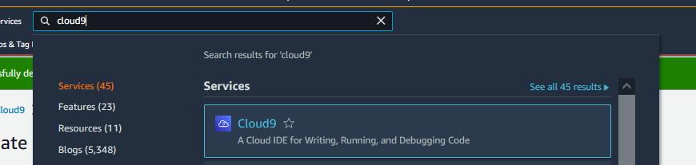

### 2.2	Create Environment

- Click on Create Environment 
- Enter any "name" for environment like "resourcelister"
- Leave everything default and create environment

<p align="center">
  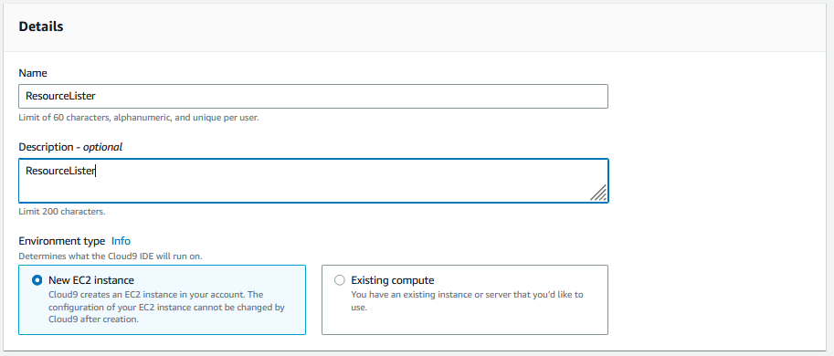


### 2.3	Once Cloud9 environment is created. Click on Environment 

<p align="center">
  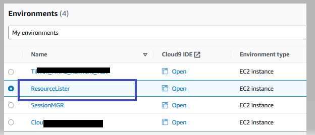


###  2.4	 Click on EC2 Instance and Manage EC2 Instance

<p align="center">
  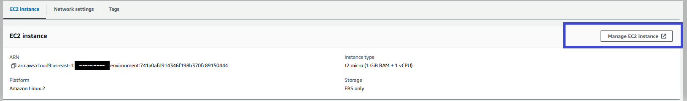

###  2.5 Click on Instance --> Action-->Security --> Modify IAM role (If Instance is stopped, Start the instance) 

<p align="center">
  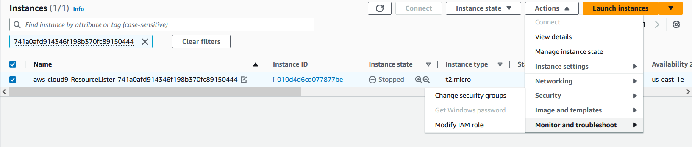


###  2.6 	Modify IAM role : 

Select the Master Account IAM Role (Role created in Step 1 or Existing Master account IAM Role) : 


<p align="center">
  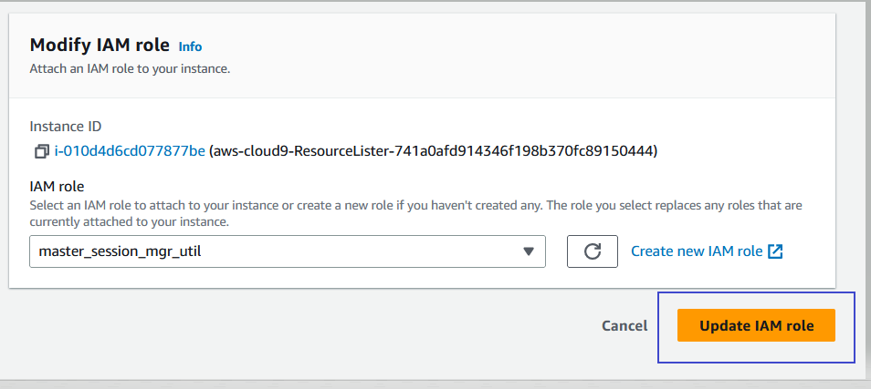


### 2.7	 Disable the AWS Managed temporary credentials
Open Cloud9 Environment got to Setting –>Preference->AWS Setting->Credentials and disable the AWS Managed temporary credentials

<p align="center">
  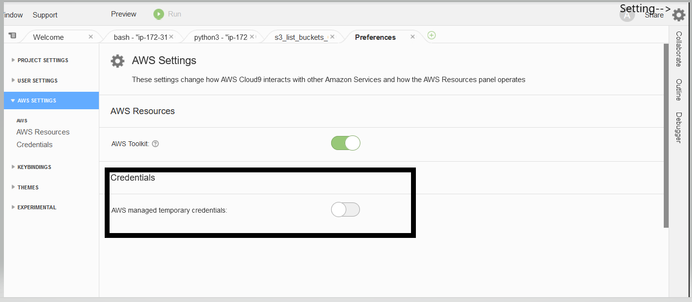


**Cloud9 Setup is completed successfully.**

</details>

<details>

  <summary># Step 3:  Install Utility </summary>


## Step 3:  Install Utility 

### 3.1 Install dependencies


Open new terminal 

<p align="center">
  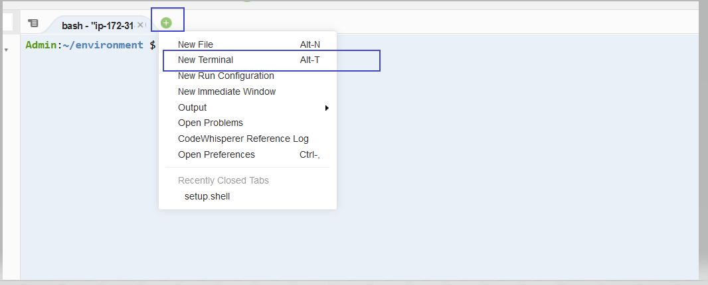

Copy following commands 


```
python3 -m pip install  pipx
python3 -m pip install  boto3
python3 -m pipx install resource-lister

```

<p align="center">
  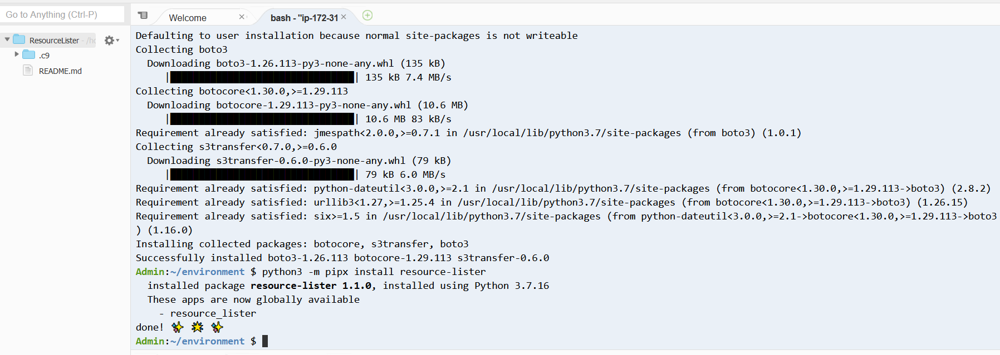

### 3.2 Run Utility


Set the default region to us-east-1
```
export AWS_DEFAULT_REGION="us-east-1"
```
Run the Utility
```
pipx run resource_lister
```


You will see Resource Lister utility disclaimer and Main Menu

<p align="center">
  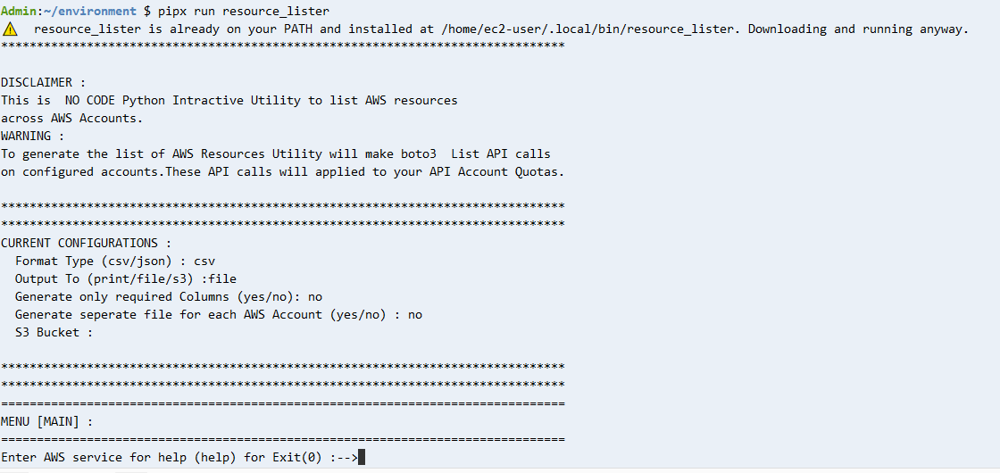

**Congratulation resource-lister is successfully installed.**

</details>

<details>

  <summary># Step 4:  Setup Master Account </summary>

## Step 4:  Setup Master Account


- Type in**help** and press ENTER
- Type in**1** for [Managed AWS Account] press ENTER
- Type in**1** for Add Master Account and press ENTER

<p align="center">
  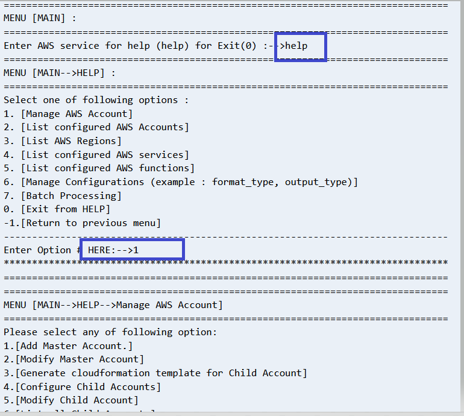

- Type in**Master Account IAM role** and press ENTER
- Type in**1** for default credentials and press ENTER
- Type in**Child Account Role Name** and press ENTER


Note here:
Utility will prompt that Master Account is successfully configured
Utility also generates the Cloudformation template for child account**cfn_child_account_template.json** .


<p align="center">
  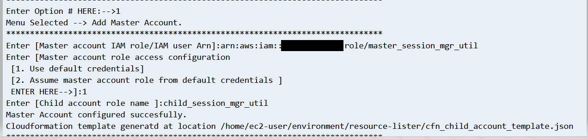

## Step 4.2 :  Verify master account is configured correctly

- Type in**0** and press ENTER to exit Manage AWS Account Menu
- Type in**0** and press ENTER to exit Help Menu
- In Main Menu (ENTER AWS Service for help (help) for exit (0) type in**S3** and press ENTER
- Type in**1** for List of S3 buckets and press ENTER
- Type in**ALL** for all the accounts and press ENTER

Utility will create**output** folder and create file for list of s3 buckets.
<p align="center">
  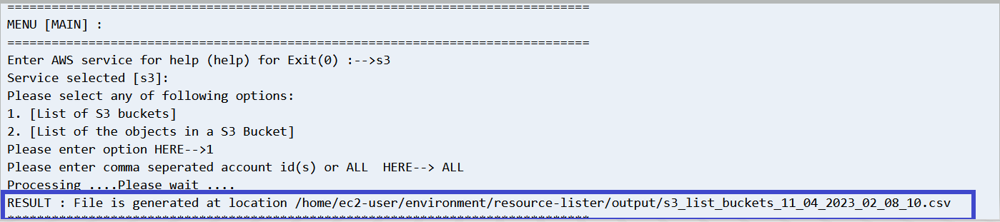

Go to resource-lister--> output--> click on s3_list_buckets_<date>.csv file
<p align="center">
  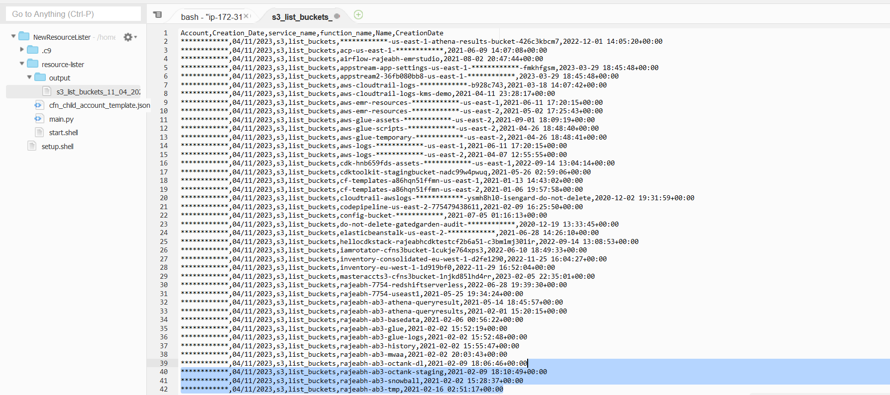


**Congratulation master account is successfully configured.**

</details>


<details>

  <summary># Step 5:  Setup Child accounts </summary>

## Step 5:  Setup Child accounts


- Type in**help** and press ENTER
- Type in**1** for [Managed AWS Account] press ENTER
- Type in**4** for Configure child Accounts and press ENTER
- Type in**Comma seperated child accounts** and press ENTER
- Press any Key to continue (Press ENTER)


If your using option2 i.e utility provided cloudformation template to create master account role . You**must** need to run the cloudformation template**cfn_child_account_template.json** in each configured child accounts.The cloudformation template**cfn_child_account_template.json**  is generated in when you setup4 i.e master account in previous step.

<p align="center">
  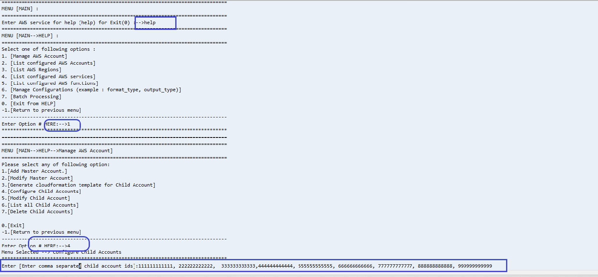


## Step 5.2 :  Verify child accounts are configured correctly

- Type in**0** and press ENTER to exit Manage AWS Account Menu
- Type in**2** and press ENTER in  Help Menu


Utility will display all the child accounts configured
<p align="center">
  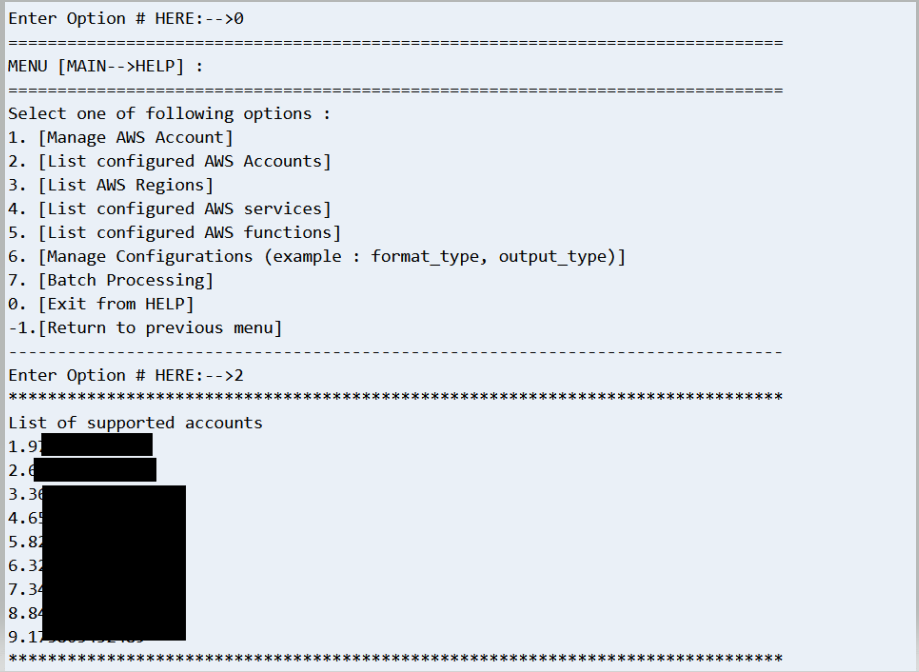


## Step 5.3 :  Verify childs accounts data is generated 

- Type in**0** and press ENTER to exit Help Menu
- In Main Menu (ENTER AWS Service for help (help) for exit (0) type in**S3** and press ENTER
- Type in**1** for List of S3 buckets and press ENTER
- Type in**ALL** for all the accounts and press ENTER

Utility will create**output** folder and create file for list of s3 buckets.
<p align="center">
  

Go to resource-lister--> output--> click on s3_list_buckets_<date>.csv file and verify all the configured accounts s3 buckets are listed
<p align="center">
  

</details>


<details>

  <summary># Step 6 (Optional):  Change output to S3 bucket </summary>

## Step 6:  Change output to S3 bucket

## Step 6.1 :  Create S3 bucket 

Download the cloudformation template from Github

https://github.com/awslabs/resource-lister/blob/main/cfn/cfn_s3_bucket_master_account.json

Go to Cloudformation and create stack with new resources and select the downloaded template

<p align="center">
  

<p align="center">
  

Enter master account role arn and click next /next and create the stack.
Cloudformation stack will create new S3 bucket . Master account IAM role will have write permissions to this new S3 bucket. 

<p align="center">
  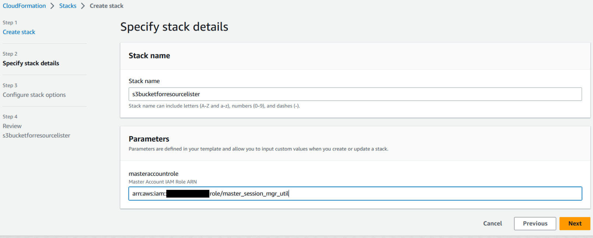

Copy the S3 bucket Name

<p align="center">
  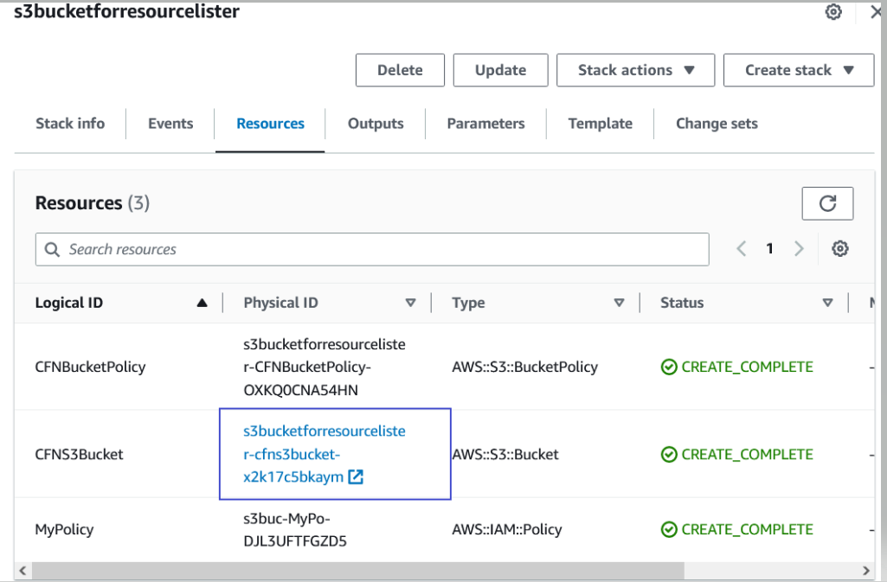

## Step 6.2:  Configure S3 bucket name

- Type in**help** and press ENTER
- Type in**6** for [Manage Configurations (example: format_type, output_type)] press ENTER
- Type in**6** for [Modify S3 Bucket Name] and press ENTER
- Type in**S3 Bucket Name (Created in step 6.1)** and press ENTER
- Press any Key to continue (Press ENTER)
<p align="center">
  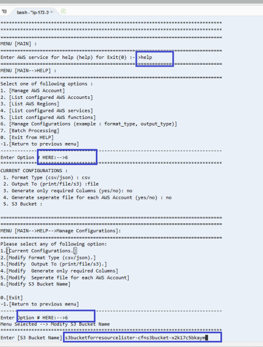

## Step 6.3 :  Configure output to S3 

- Type in**3** for [Modify Output To (print/file/s3).] press ENTER
- Type in**s3** and press ENTER

Verify the output type updated to**s3** and S3 Bucket Name updated properly

<p align="center">
  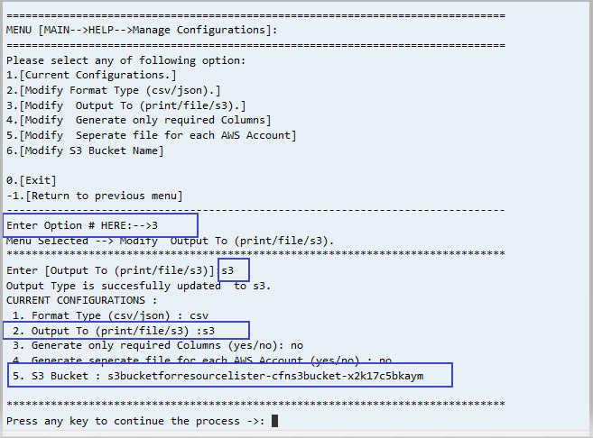


## Step 6.4 : Verify Results generated on S3

- Type in**0** and press ENTER to exit Help Menu
- In Main Menu (ENTER AWS Service for help (help) for exit (0) type in**S3** and press ENTER
- Type in**1** for List of S3 buckets and press ENTER
- Type in**ALL** for all the accounts and press ENTER

Utility will generate the file on configured s3 bucket 
<p align="center">
  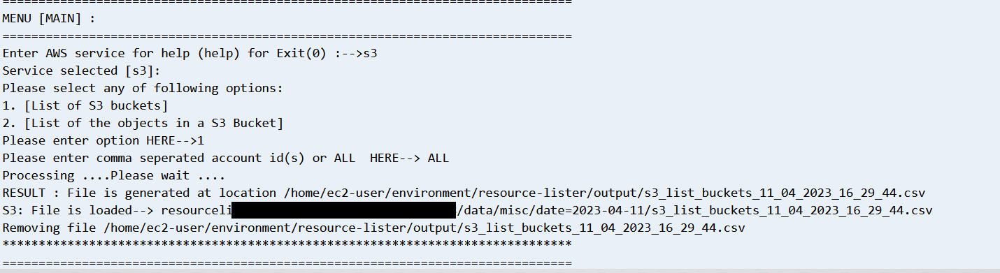


</details>
