# Resource Lister Cloud 9 Setup Guide 


<details>
  <summary># Step 1: Master Account and Child Account Roles </summary>

## Step 1: Master Account and Child Account Roles 
To Configure resource-lister you need
 1. Master Account IAM Role ARN 
 2. Child Account Role Name 
You can use existing master /child account setup or create new roles.

**Option 1: Use existing Master /Child Account Setup** 

If you already have AWS Organization setup with Master /Child accounts Roles you can re-use the existing Master Account Role Child Account Roles.  Please note existing Master Account IAM Role should have Cloud9 Permission. You can attach following managed policy to existing Master Account Roles to get Cloud9 permissions.

1. AWSCloud9EnvironmentMember
2. ReadOnlyAccess
3. AWSCloud9User
4. AWSCloud9SSMInstanceProfile
5. AWSCloud9Administrator

**Option 2: Create new Master Account /Child Account Roles**

Download the cloudformation template from Github

https://github.com/awslabs/resource-lister/-/blob/main/cfn/master_account_IAM_role.json

Go to Cloudformation and create stack with new resources

<p align="center">
  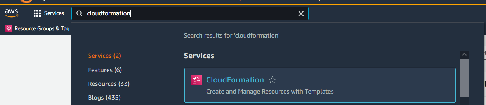

<p align="center">
  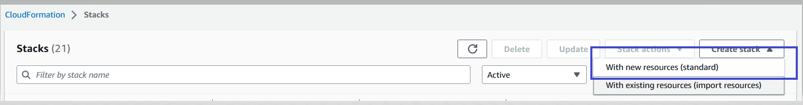

Create Role in Master account by running the cloudformation template 


Enter Stack Name: 
MasterAccountRoleName:  This role will be created in master account. Utility will use this role to assume child account roles

ChildAccountRoleName: Master account role will have permission to assume this role.


<p align="center">
  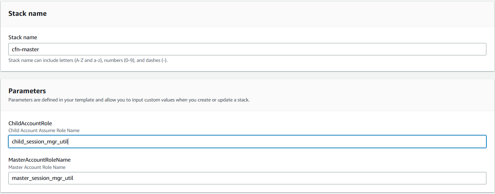

Keep all other values as default and click Next, Next and submit.

Cloudformation stack will be created. Go to output tab and copy the values

<p align="center">
  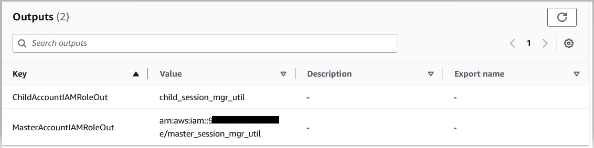

</details>

<details>

  <summary># Step 2:  Setup Cloud9 Environment </summary>


## Step 2:  Setup Cloud9 Environment

In this step you will create Cloud9 Environment and Modify the role of Underlying Cloud9 Ec2 instance to use Master Account IAM role. You will also disable the AWS Managed temporary credentials. 

### 2.1	Type in Cloud9 (us-east-1 region) 
<p align="center">
  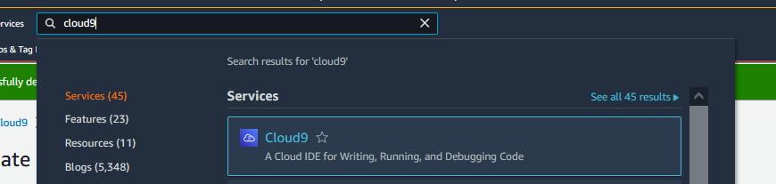

### 2.2	Create Environment

- Click on Create Environment 
- Enter any "name" for environment like "resourcelister"
- Leave everything default and create environment

<p align="center">
  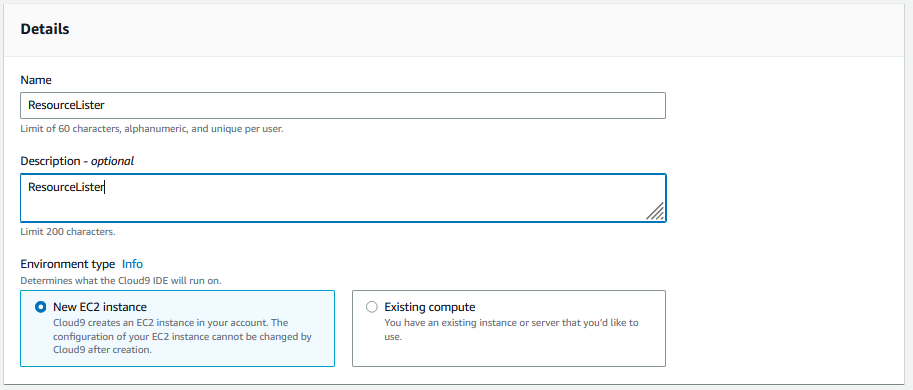


### 2.3	Once cloud9 environment is created. Click on Environment 

<p align="center">
  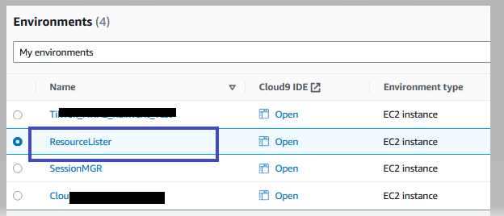


###  2.4	Click on EC2 Instance and Manage EC2 Instance

<p align="center">
  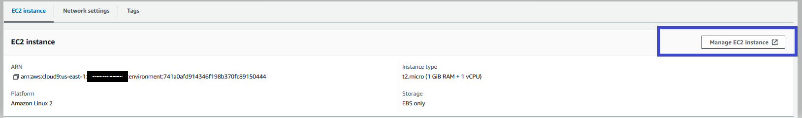

###  2.5	Click on Instance --> Action-->Security --> Modify IAM role (If Instance is stopped, Start the instance) 

<p align="center">
  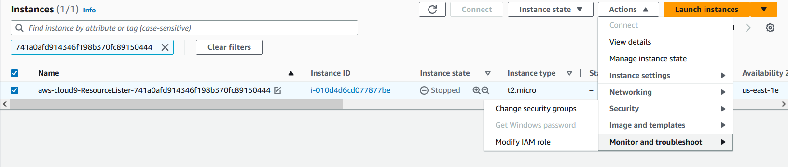


###  2.6 	Modify IAM role : 

Select the Master Account IAM Role (Role created in Step 1 or Existing IAM Role) : 


<p align="center">
  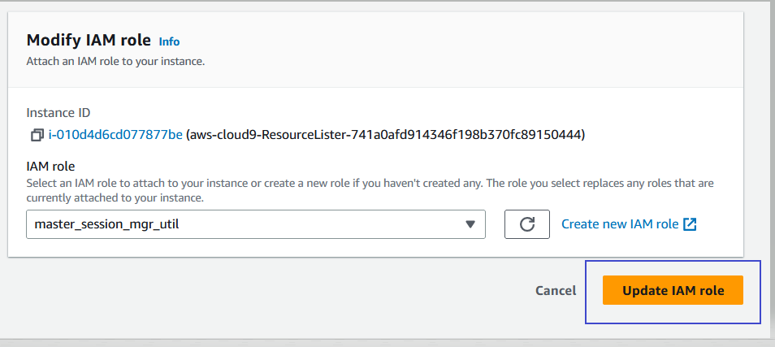


### 2.7	 Disable the AWS Managed temporary credentials
Open Cloud9 Environment got to Setting –Preference->AWS Setting->Credentials and disable the AWS Managed temporary credentials

<p align="center">
  


**Cloud9 Setup is completed successfully.**

</details>

<details>

  <summary># Step 3:  Install Utility  </summary>


## Step 3:  Install Utility 

### 3.1 Rune onetime setup from Github

Open new terminal 

<p align="center">
  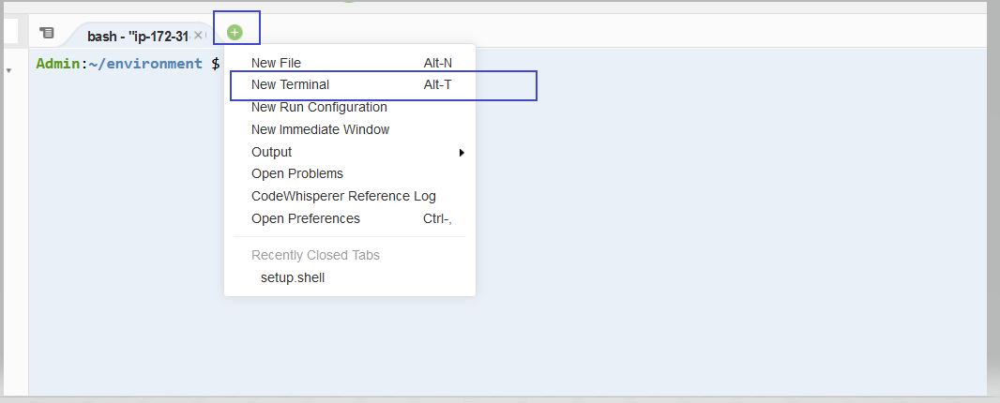

Copy following commands


```
wget -q https://github.com/awslabs/resource-lister/tree/main/install/cloud9/setup.shell > /dev/null

chmod 777 setup.shell

./setup.shell

```
Once you run above commands successfully you will see that 
resource-lister folder will be created and inside the resource-lister folder there will be two files get copied main.py and start.shell

<p align="center">
  

### 3.2 Start the utility

Go to resource-lister folder and run the start.shell

```
cd resource-lister
./start.shell

```

You will see utility disclaimer and main menu

<p align="center">
  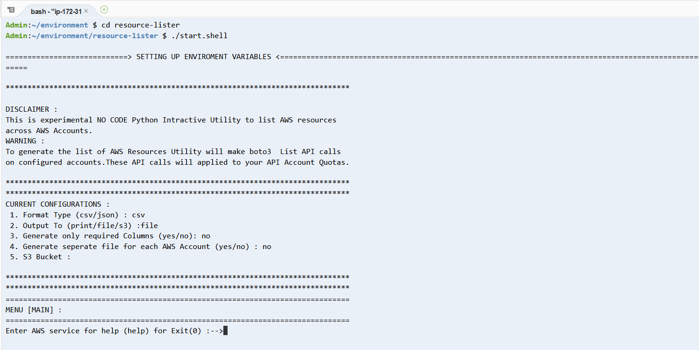

**Congratulation resource-lister is successfully installed.**

</details>

<details>

  <summary># Step 4:  Setup Master Account </summary>

## Step 4:  Setup Master Account


- Type in **help** and press ENTER
- Type in **1** for [Managed AWS Account] press ENTER
- Type in **1** for Add Master Account and press ENTER

<p align="center">
  

- Type in **Master Account IAM role** and press ENTER
- Type in **1** for default credentials and press ENTER
- Type in **Child Account Role Name** and press ENTER
Utility will generate the Cloudformation template for child account. Utility will prompt the message Master Account is successfully configured


<p align="center">
  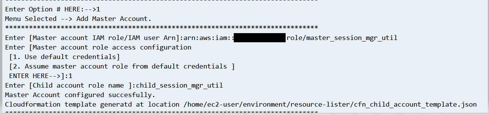

## Step 4.2 :  Verify master account is configured correctly

- Type in **0** and press ENTER to exit Manage AWS Account Menu
- Type in **0** and press ENTER to exit Help Menu
- In Main Menu (ENTER AWS Service for help (help) for exit (0) type in **S3** and press ENTER
- Type in **1** for List of S3 buckets and press ENTER
- Type in **ALL** for all the accounts and press ENTER

Utility will create **output** folder and create file for list of s3 buckets.
<p align="center">
  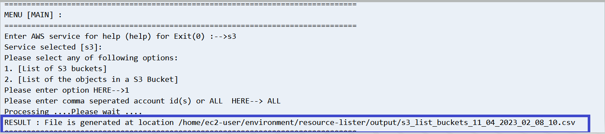

Go to resource-lister--> output--> click on s3_list_buckets_<date>.csv file
<p align="center">
  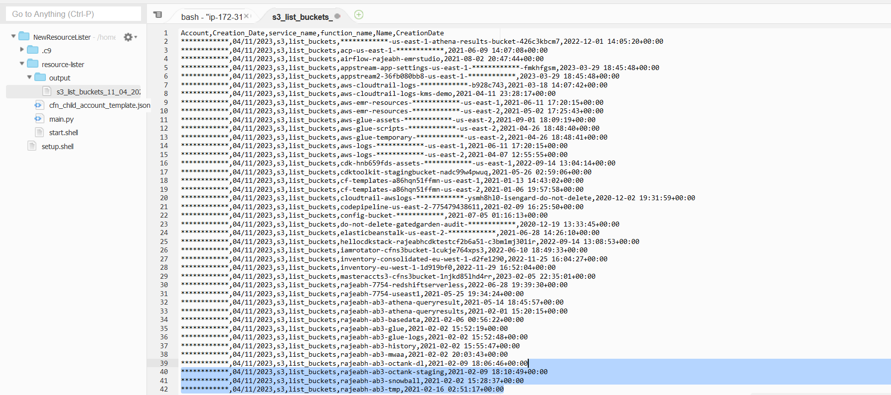


**Congratulation master account is successfully configured.**

</details>


<details>

  <summary># Step 5:  Setup Child  Accounts </summary>

## Step 5:  Setup Child  Accounts


- Type in **help** and press ENTER
- Type in **1** for [Managed AWS Account] press ENTER
- Type in **4** for Configure child Accounts and press ENTER
- Type in **Comma seperated child accounts** and press ENTER
- Press any Key to continue (Press ENTER)

<p align="center">
  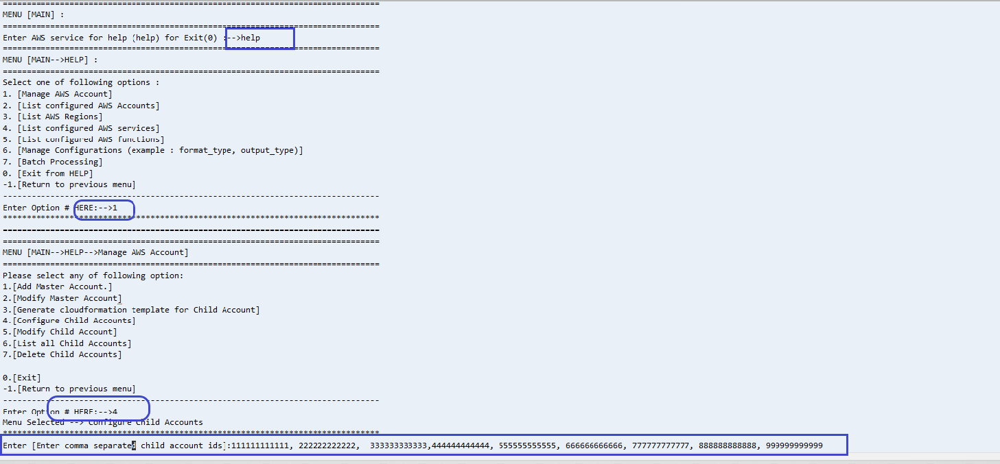


## Step 5.2 :  Verify child accounts are configured correctly

- Type in **0** and press ENTER to exit Manage AWS Account Menu
- Type in **2** and press ENTER in  Help Menu


Utility will display all the child accounts configured
<p align="center">
  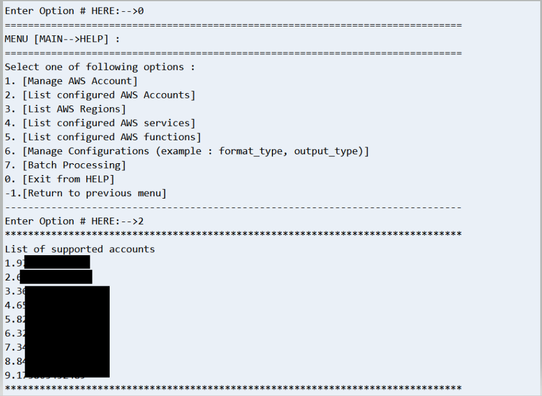


## Step 5.3 :  Verify childs accounts data is generated 

- Type in **0** and press ENTER to exit Help Menu
- In Main Menu (ENTER AWS Service for help (help) for exit (0) type in **S3** and press ENTER
- Type in **1** for List of S3 buckets and press ENTER
- Type in **ALL** for all the accounts and press ENTER

Utility will create **output** folder and create file for list of s3 buckets.
<p align="center">
  

Go to resource-lister--> output--> click on s3_list_buckets_<date>.csv file and verify all the configured accounts s3 buckets are listed
<p align="center">
  

</details>


<details>

  <summary># Step 6 (Optional):  Change output to S3 bucket </summary>

## Step 6:  Change output to S3 bucket

## Step 6.1 :  Create S3 bucket 

Download the cloudformation template from Github

https://github.com/awslabs/resource-lister/-/blob/main/cfn/cfn_s3_bucket_master_account.json

Go to Cloudformation and create stack with new resources and select the downloaded template

<p align="center">
  

<p align="center">
  

Enter master account role arn and click next /next and create the stack.
Clouformation stack will create new S3 bucket . Master account IAM role will have write permissions to this new S3 bucket. 

<p align="center">
  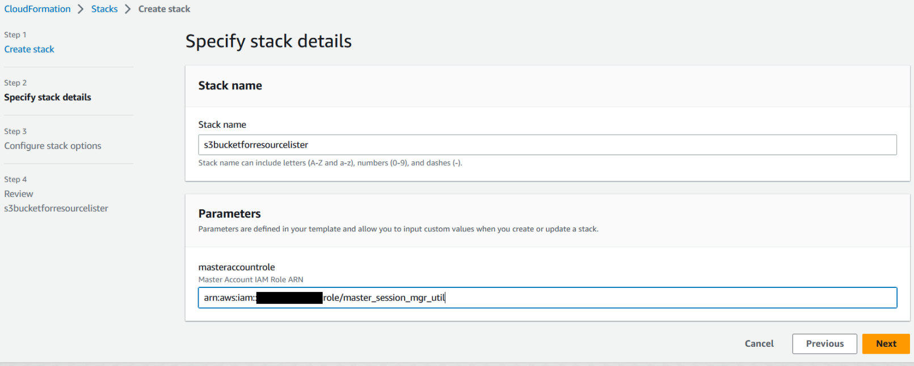

Copy the S3 bucket Name

<p align="center">
  

## Step 6.2 :  Configure S3 bucket name

- Type in **help** and press ENTER
- Type in **6** for [Manage Configurations (example : format_type, output_type)] press ENTER
- Type in **6** for [Modify S3 Bucket Name] and press ENTER
- Type in **S3 Bucket Name (Created in step 6.1)** and press ENTER
- Press any Key to continue (Press ENTER)
<p align="center">
  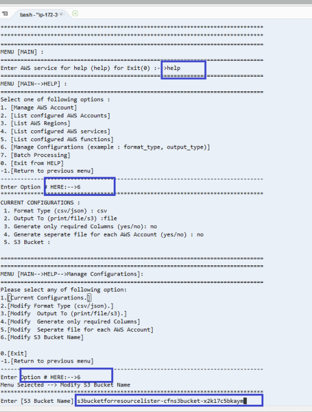

## Step 6.3 :  Configure output to S3 (instead of file)

- Type in **3** for [Modify  Output To (print/file/s3).] press ENTER
- Type in **s3** and press ENTER

verify the output type updated to **s3** and S3 Bucket Name updated properly

<p align="center">
  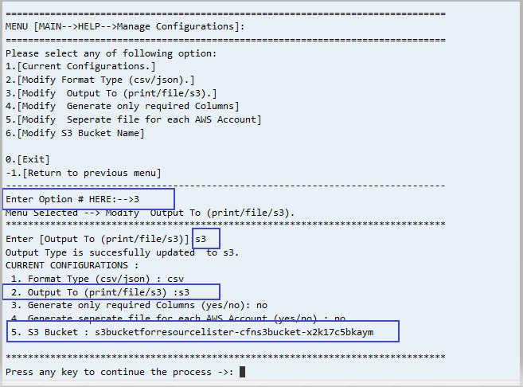


## Step 6.4 : Verify results generated on S3

- Type in **0** and press ENTER to exit Help Menu
- In Main Menu (ENTER AWS Service for help (help) for exit (0) type in **S3** and press ENTER
- Type in **1** for List of S3 buckets and press ENTER
- Type in **ALL** for all the accounts and press ENTER

Utility will generate the file on configured s3 bucket 
<p align="center">
  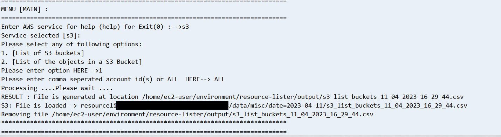


</details>
