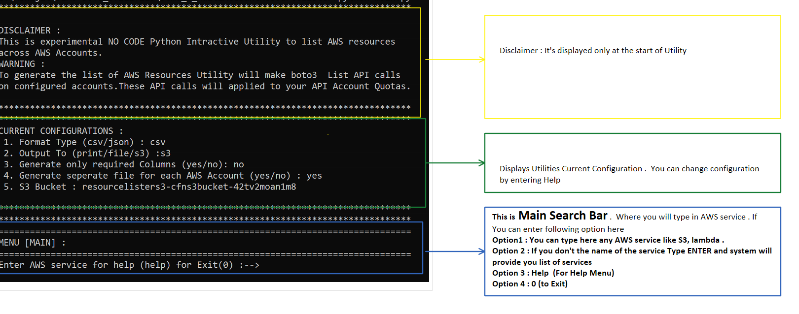
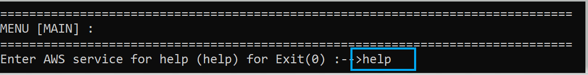
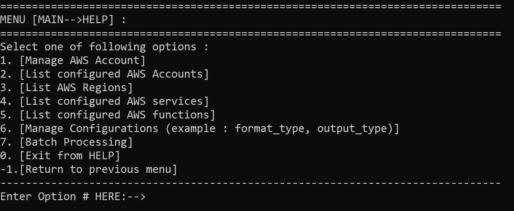

# Resource Lister Help Guide 

  
General 

##  Main Search Bar 

  

  
Help Menu 

##  Help Menu 
To Navigate help menu type in help

  
Help menu will be displayed as below

  

ENTER **1**: It will navigate to Manage AWS Accounts Menu:  Manage AWS Account will provide you additional options to configure Master Account, Child Accounts and generate cloudformation templates for Child accounts.

Enter **1**:  This will display lists of configured AWS Accounts

Enter **2**:  This will display list of AWS Regions

Enter **3**: This will display list of configured AWS services

Enter **4**: This will display list of AWS services and corresponding functions 

Enter **5**: It will navigate to Manage Configurations Menu. Manage Configuration menu will provide additional options like to change format type from csv to Json or send output to S3 instead of local disk

Enter **6**: This will give an option to run in batch mode to generate list of all the supported resources in a particular AWS account

