# Resource Lister: Expanding Resource Lister Capabilities: Adding Support for Additional AWS Services and Functions


Resource Lister currently supports listing and describing resources for 38 common AWS services, with approximately 100 related functions. However, Boto3 provides access to over 350 AWS services with more than 3,500 functions just for listing and describing resources. This article demonstrates how Resource Lister can be easily extended to support additional AWS services beyond the 38 currently enabled. By creating a one-time configuration file per service Resource Lister will automatically detect, any of the 350+ services and 3,500+ describe/list functions in Boto3 can be added with minimal effort. This configuration file approach allows Resource Lister's capabilities to be expanded as needed to leverage all AWS services Boto3 supports.


**Let's consider a scenario where we want to expand the capabilities of the Resource Lister application to include support for two additional AWS services: Kinesis and Firehose. Specifically, we would like to add functionality to list Kinesis streams and describe stream details, as well as list Firehose delivery streams. This will allow Resource Lister to provide visibility into Kinesis Streams and Firehose resources in your AWS accounts**


You can find the boto3 API documentation for these functions at the links below:

- Amazon Kinesis Streams
  - [list_streams](https://boto3.amazonaws.com/v1/documentation/api/1.35.9/reference/services/kinesis/client/list_streams.html)
  - [describe_stream](https://boto3.amazonaws.com/v1/documentation/api/1.35.9/reference/services/kinesis/client/describe_stream.html)

- Amazon Kinesis Firehose
  - [list_delivery_streams](https://boto3.amazonaws.com/v1/documentation/api/latest/reference/services/firehose/client/list_delivery_streams.html)

Lets quickly check if these services are already supported in Resource Lister. You can do this by typing ENTER in the MAIN Menu.


<p align="center">
  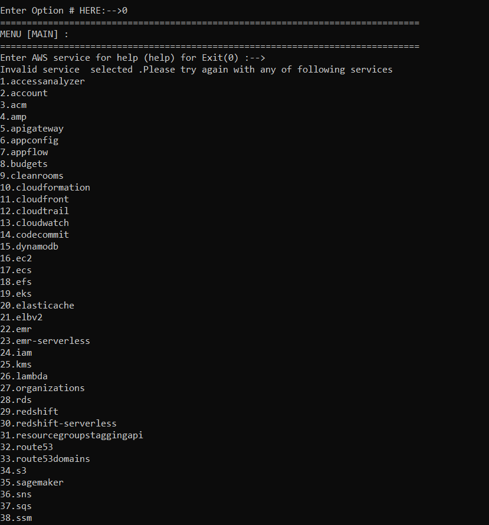

Notice that Kinesis stream and Kinesis firehose is not listed.


## Step 1:  Structure  of service configuration file.
The resource lister has a configuration file for each service it supports. Each configuration file contains metadata for the functions in that service. Config files are place in service_configs directory. https://github.com/awslabs/resource-lister/tree/main/src/resource_lister/boto_formatter/service_config_mgr/service_configs.


<p align="center">
  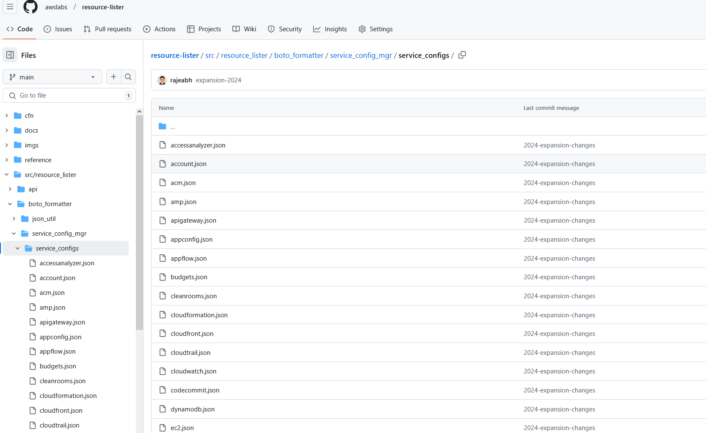


The configuration files contain lists of functions and their associated metadata that the functions require.

<p align="center">
  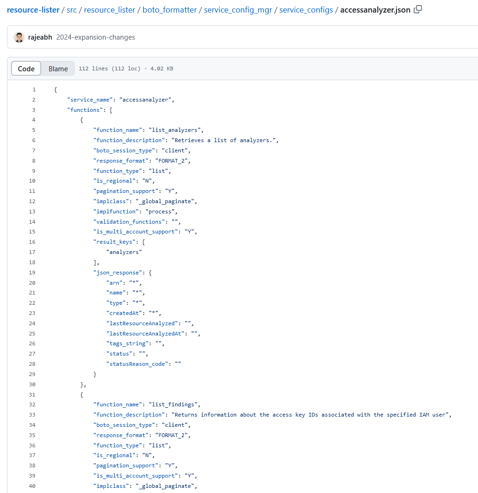


Let's briefly examine the metadata attributes and their corresponding values.

# Configuration file Metadata 


 <table  border = "1px solid black">
  <tr>
    <th>Attribute</th>
    <th>Description</th>
    <th>Values</th>
  </tr>
  <tr>
    <td>service name</td>
    <td>Boto3 resource like s3, ec2</td>
    <td>Example : s3</td>
  </tr>
    <tr>
    <td>function_name</td>
    <td>boto3_function name </td>
    <td>Example : list_buckets</td>
  </tr>
  <tr>
    <td>function_description</td>
    <td>Utility Interface displays description information  </td>
    <td>Example : List of S3 bucket</td>
  </tr>
  <tr>
    <td>boto_session_type</td>
    <td>Currently supported only Client  </td>
    <td>Client</td>
  </tr>
    <tr>
    <td>response_format</td>
    <td> 
FORMAT_1 : JSON single record <a href="https://github.com/awslabs/resource-lister/blob/main/src/resource_lister/boto_formatter/service_config_mgr/service_configs/eks.json "> Example for FORMAT_1 </a>
 <br>
FORMAT_2 : JSON contains List of JSON<br>
Example is list_buckets <a href="https://github.com/awslabs/resource-lister/blob/main/src/resource_lister/boto_formatter/service_config_mgr/service_configs/s3.json "> Example for FORMAT_2 </a> <br>
FORMAT_3: JSON contains List of Strings<br>
<a href="https://github.com/awslabs/resource-lister/blob/main/src/resource_lister/boto_formatter/service_config_mgr/service_configs/ecs.json "> Example for FORMAT_3 </a> <br>
<br>


Majority of functions are returning list of JSON i.e FORMAT_2
  </td>
    <td>
    Any ONE of below value <br>
FORMAT_1 <br>
FORMAT_2 <br>
FORMAT_3<br>
</td>
  </tr>

  <tr>
    <td>function_type</td>
    <td>The only option that is available is the List. </td>
    <td>List</td>
  </tr>
  <tr>
    <td>is_regional</td>
    <td>Resource is regional or global </td>
    <td>Y [Regional resource like ec2] <br> or N [Global resource like S3, IAM]</td>
  </tr>
    <tr>
    <td>implclass</td>
    <td>Resource Framework Base Class: The implementation of this base class 
    <br> varies depending on whether the AWS resource is global or regional, and whether it supports pagination.<br> 
_global_no_paginate [Like S3 list buckets] <br>
_global_paginate [like IAM list_roles]<br>
_regional_paginate[ec2, lambda all regional services]<br>
_regional_no_paginate [ec2 describe_addresses]<br>
You can create your own implementation class.

</td>
  <td>Any ONE of below value <br>
  _global_no_paginate<br>
  _global_paginate<br>
  _regional_paginate<br>
  _regional_no_paginate<br>

  </td>
  </tr>

  <tr>
    <td>implfunction</td>
    <td>process </td>
    <td>process </td>

  </tr>


  <tr>
    <td>pagination_support</td>
    <td>Does the boto3 library have support for pagination for this function </td>
    <td>Any ONE of below value <br>Y <br> N </td>

  </tr>

  <tr>
    <td>is_multi_account_support</td>
    <td>The application allows users to input multiple AWS accounts in most cases. The default value is 'Y', indicating multiple accounts can be entered. However, for certain functions like listing S3 buckets or describing any resource users should only enter a single account. As Bucket reside within one AWS account. So for that feature, the value is set to 'N' to restrict the user to providing a single account. </td>
    <td>Any ONE of below value <br>Y <br> N </td>

  </tr>

   <tr>
    <td>validation_functions</td>
    <td>Blank </td>
    <td>None</td>
    
  </tr>
      <tr>
    <td>pagination_attributes</td>
    <td>If a particular function requires user input, that input is captured using pagination attributes. For example, to list objects in an S3 bucket, the user needs to provide the BucketName. The BucketName is captured using a pagination attribute. <b>if there is no input requires you don't need to specifiy pagination_attributes</b></td>
    <td> 
    
    Example value : pagination_attributes": [ 
        {
            "attribute_name": "Bucket", 
            "attribute_value": "",
            "is_visible": "Yes",
            "display_prompt": "The name of the bucket containing the objects"
        }
    ],
</td>
    
  </tr>
      <tr>
    <td>result_keys</td>
    <td>boto3 function Response JSON key that returns list of resources (usually Array) <br>
  "result_keys": [ 
                  “key1",
                  "Key"
              ]
 </td>
    <td>Single Key example : 
"result_keys": [
                "analyzers"
            ]

<br>
Multi Key example: 
Cloufront : list_distributions


"result_keys": [
                "DistributionList",
                "Items"
            ]
</td>
    
  </tr>

  <tr>
    <td>json_response</td>
    <td>
The Boto3 function returns the response in JSON format. This element defines the stucture of Single Element of JSON object that the function would return, which can be referenced from the Boto3 API documentation: </td>
    <td>Example : ": {
        "Name": "required",
        "CreationDate": "required"
    }
</td>
    
  </tr>
</table> 

Note that for json_response we will use Resource Lister to flatten the raw function response . We will see that in following example.
You can also examine reference functions

## Step 2: Refer to the boto3 API documentation to create a configuration file for each boto3 function

Since we understand the configuration file metadata. Now we will create three configuration files for each of the boto3 function we want to add to resource lister.
- Amazon Kinesis Streams
  - [list_streams](https://boto3.amazonaws.com/v1/documentation/api/1.35.9/reference/services/kinesis/client/list_streams.html)
  - [describe_stream](https://boto3.amazonaws.com/v1/documentation/api/1.35.9/reference/services/kinesis/client/describe_stream.html)

- Amazon Kinesis Firehose
  - [list_delivery_streams](https://boto3.amazonaws.com/v1/documentation/api/latest/reference/services/firehose/client/list_delivery_streams.html)

We will create a top level folder with any name. Inside the top level folder, we will create a separate folder for each service. Within each service folder, we will create a .json file for each boto3 function that the service uses.As shown in the diagram below,

<p align="center">
  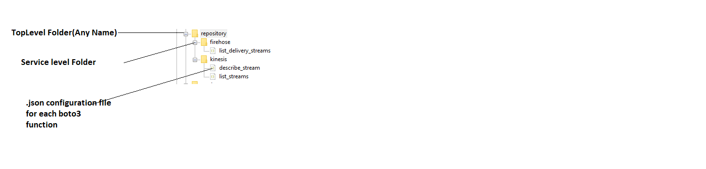


We will refere Boto3 documentation and create three configuration files .

### 1.BUILD :list_streams.json

Refer boto3 API documentation for describe_stream. https://boto3.amazonaws.com/v1/documentation/api/1.26.89/reference/services/kinesis/client/list_streams.html

 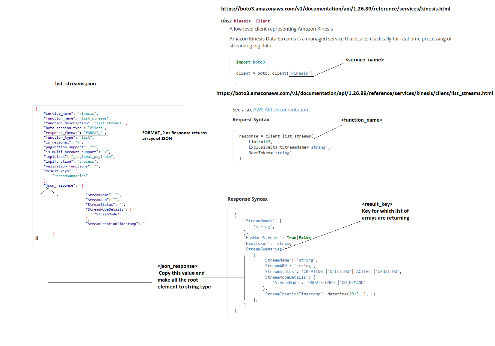

**Fill in metadata fields**
<table  border = "1px solid black">
	<tr>
	<th>service_name</th>
	<th>kinesis</th>
	<th>Reference :https://boto3.amazonaws.com/v1/documentation/api/1.35.9/reference/services/kinesis.html : Should be same as boto3 client</th>
	</tr>
	<tr>
	<td>function_name</td>
	<td>list_streams</td>
	<td>Reference : https://boto3.amazonaws.com/v1/documentation/api/1.26.89/reference/services/kinesis/client/list_streams.html</td>
	</tr>
	<tr>
	<td>function_description</td>
	<td>list_streams </td>
	<td>Any Description</td>
	</tr>
	<tr>
	<td>boto_session_type</td>
	<td>client</td>
	<td>Only value supported is client</td>
	</tr>
	<tr>
	<td>response_format</td>
	<td>FORMAT_2</td>
	<td> JSON Response of list_streams boto3 function retruns Arrays of JSON objects </td>
	</tr>
	<tr>
	<td>function_type</td>
	<td>list</td>
	<td>Only value supported is list</td>
	</tr>
	<tr>
	<td>is_regional</td>
	<td>Y</td>
	<td>Kinesis stream is Regional resource so value is Y </td>
	</tr>
	<tr>
	<td>pagination_support</td>
	<td>Y</td>
	<td>list_streams function supports pagination </td>
	</tr>
	<tr>
	<td>is_multi_account_support</td>
	<td>Y</td>
	<td>The option to provide multiple accounts (Value) is selected because User can search streams accross multiple accounts at a time.</td>
	</tr>
	<tr>
	<td>implclass</td>
	<td>_regional_paginate</td>
	<td>The Kinesis stream is a regional service and the list_streams API support pagination. Therefore, the framework class that was selected is 'regional_paginate' </td>
	</tr>
	<tr>
	<td>implfunction</td>
	<td>process</td>
	<td>process</td>
	</tr>
	<tr>
	<td>validation_functions</td>
	<td></td>
	<td></td>
	</tr>
	<tr>
	<td>result_keys</td>
	<td>StreamSummaries</td>
	<td>list_streams function JSON Response Key for which values are formatted</td>
	</tr>
	<tr>
	<td>json_response</td>
	<td>{

			            "StreamName": "",
			            "StreamARN": "",
			            "StreamStatus": "",
			            "StreamModeDetails": {
			                "StreamMode": ""
			            },
			            "StreamCreationTimestamp": ""}
  </td>
  <td>Value refered from list_streams Reference Response</td>
	</tr>
</table>

**FINAL:list_streams.json**
```

{
    "service_name": "kinesis",
    "function_name": "list_streams",
    "function_description": "list_streams ",
    "boto_session_type": "client",
    "response_format": "FORMAT_2",
    "function_type": "list",
    "is_regional": "Y",
    "pagination_support": "Y",
    "is_multi_account_support": "Y",
    "implclass": "_regional_paginate",
    "implfunction": "process",
    "validation_functions": "",
    "result_keys": [
        "StreamSummaries"
    ],
    "json_response":  {

			            "StreamName": "",
			            "StreamARN": "",
			            "StreamStatus": "",
			            "StreamModeDetails": {
			                "StreamMode": ""
			            },
			            "StreamCreationTimestamp": ""

        }
}
```

### 2.BUILD :describe_stream.json

Refer boto3 API documentation for describe_stream. https://boto3.amazonaws.com/v1/documentation/api/1.35.9/reference/services/kinesis/client/describe_stream.html


 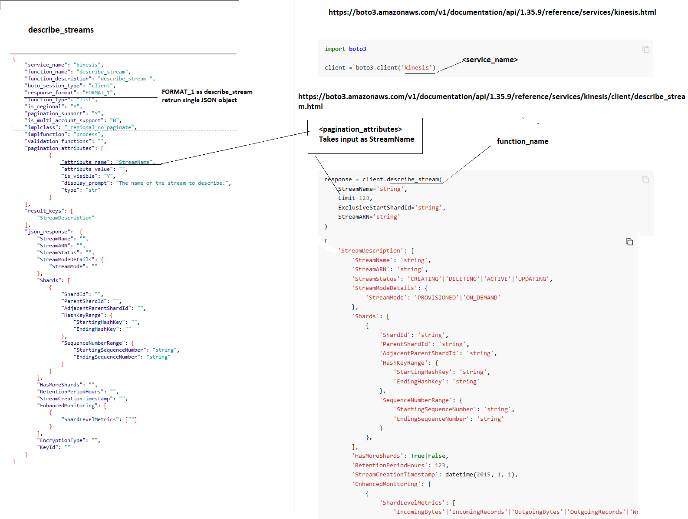


**Fill in metadata fields**

<table  border = "1px solid black">
<tr>
<th>service_name</th>
<th>kinesis</th>
<th>Reference :https://boto3.amazonaws.com/v1/documentation/api/1.35.9/reference/services/kinesis.html : Should be same as boto3 client</th>
</tr>
<tr>
<td>function_name</td>
<td>describe_stream</td>
<td>Reference : https://boto3.amazonaws.com/v1/documentation/api/1.35.9/reference/services/kinesis/client/describe_stream.html</td>
</tr>
<tr>
<td>function_description</td>
<td>describe_stream </td>
<td>Any Description</td>
</tr>
<tr>
<td>boto_session_type</td>
<td>client</td>
<td>Only value supported is client</td>
</tr>
<tr>
<td>response_format</td>
<td>FORMAT_1</td>
<td> JSON Response of describe_streams boto3 function retruns Single JSON object </td>
</tr>
<tr>
<td>function_type</td>
<td>list</td>
<td>Only value supported is list</td>
</tr>
<tr>
<td>is_regional</td>
<td>Y</td>
<td>Kinesis stream is Regional resource so value is Y </td>
</tr>

<tr>
<td>pagination_support</td>
<td>N</td>
<td>describe_streams function returns single JSON object we don't need pagination </td>
</tr>
<tr>
<td>is_multi_account_support</td>
<td>N</td>
<td>he option to provide multiple accounts (Value) is deselected (set to N for no) because we do not want the user to input more than one account.</td>
</tr>
<tr>
<td>implclass</td>
<td>_regional_no_paginate</td>
<td>The Kinesis stream is a regional service and the describe_stream API does not support pagination. Therefore, the framework class that was selected is 'regional_no_paginate' </td>
</tr>

<tr>
<td>implfunction</td>
<td>process/td>
<td>process</td>
</tr>
<tr>
<td>validation_functions</td>
<td></td>
<td></td>
</tr>

<tr>
<td>pagination_attributes</td>
<td> "pagination_attributes": [
{
"attribute_name": "StreamName",
"attribute_value": "",
"is_visible": "Y",
"display_prompt": "The name of the stream to describe.",
"type": "str"
}
]
</td>
<td>Since describe_streams takes StreamName as input, we need to define pagination attributes to caputre user input for StringName</td>
</tr>

<tr>
<td>result_keys</td>
<td>StreamDescription</td>
<td>describe_streams function JSON Response Key for which values are formatted</td>
</tr>

<tr>
<td>json_response</td>
  <td>{
        "StreamName": "",
        "StreamARN": "",
        "StreamStatus": "",
        "StreamModeDetails": {
            "StreamMode": ""
        },
        "Shards": [
            {
                "ShardId": "",
                "ParentShardId": "",
                "AdjacentParentShardId": "",
                "HashKeyRange": {
                    "StartingHashKey": "",
                    "EndingHashKey": ""
                },
                "SequenceNumberRange": {
                    "StartingSequenceNumber": "string",
                    "EndingSequenceNumber": "string"
                }
            }
        ],
        "HasMoreShards": "",
        "RetentionPeriodHours": "",
        "StreamCreationTimestamp": "",
        "EnhancedMonitoring": [
            {
                "ShardLevelMetrics": [
                    "",
                ]
            }
        ],
        "EncryptionType": "",
        "KeyId": ""
    }
}</td>
  <td>Value refered from desribe_streams Reference Response</td>
</tr>
</table>

**FINAL : describe_stream.json**

```

 {
    "service_name": "kinesis",
    "function_name": "describe_stream",
    "function_description": "describe_stream ",
    "boto_session_type": "client",
    "response_format": "FORMAT_2",
    "function_type": "list",
    "is_regional": "Y",
    "pagination_support": "Y",
    "is_multi_account_support": "Y",
    "implclass": "_regional_paginate",
    "implfunction": "process",
    "validation_functions": "",
    "pagination_attributes": [
	        {
	            "attribute_name": "StreamName",
	            "attribute_value": "",
	            "is_visible": "Yes",
	            "display_prompt": "The name of the stream to describe."
	        }
    ]
    "result_keys": [
        "StreamDescription"
    ],
    "json_response":  {
        "StreamName": "",
        "StreamARN": "",
        "StreamStatus": "",
        "StreamModeDetails": {
            "StreamMode": ""
        },
        "Shards": [
            {
                "ShardId": "",
                "ParentShardId": "",
                "AdjacentParentShardId": "",
                "HashKeyRange": {
                    "StartingHashKey": "",
                    "EndingHashKey": ""
                },
                "SequenceNumberRange": {
                    "StartingSequenceNumber": "string",
                    "EndingSequenceNumber": "string"
                }
            }
        ],
        "HasMoreShards": "",
        "RetentionPeriodHours": "",
        "StreamCreationTimestamp": "",
        "EnhancedMonitoring": [
            {
                "ShardLevelMetrics": [
                    "",
                ]
            }
        ],
        "EncryptionType": "",
        "KeyId": ""
    }
}

```


### 3.BUILD :list_delivery_streams.json

Refer boto3 API documentation for list_delivery_streams
https://boto3.amazonaws.com/v1/documentation/api/latest/reference/services/firehose/client/list_delivery_streams.html

 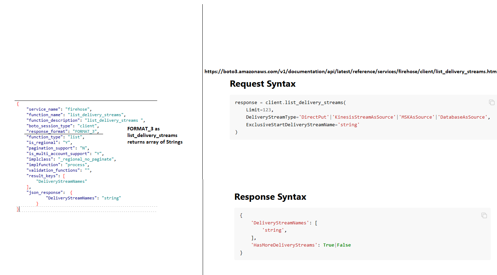


**Fill in metadata fields**

<table  border = "1px solid black">
	<tr>
	<th>service_name</th>
	<th>firehose</th>
	<th>Reference :https://boto3.amazonaws.com/v1/documentation/api/1.35.9/reference/services/firehose.html : Should be same as boto3 client</th>
	</tr>
	<tr>
	<td>function_name</td>
	<td>list_delivery_streams</td>
	<td>Reference : https://boto3.amazonaws.com/v1/documentation/api/latest/reference/services/firehose/client/list_delivery_streams.html</td>
	</tr>
	<tr>
	<td>function_description</td>
	<td>list_delivery_streams </td>
	<td>Any Description</td>
	</tr>
	<tr>
	<td>boto_session_type</td>
	<td>client</td>
	<td>Only value supported is client</td>
	</tr>
	<tr>
	<td>response_format</td>
	<td>FORMAT_3</td>
	<td> JSON Response of list_delivery_streams boto3 function retruns Arrays of Strings </td>
	</tr>
	<tr>
	<td>function_type</td>
	<td>list</td>
	<td>Only value supported is list</td>
	</tr>
	<tr>
	<td>is_regional</td>
	<td>Y</td>
	<td>Kinesis Firehose is Regional resource so value is Y </td>
	</tr>
	<tr>
	<td>pagination_support</td>
	<td>N</td>
	<td>list_delivery_streams function doesn't supports pagination </td>
	</tr>
	<tr>
	<td>is_multi_account_support</td>
	<td>Y</td>
	<td>The option to provide multiple accounts (Value) is selected because User can search streams accross multiple accounts at a time.</td>
	</tr>
	<tr>
	<td>implclass</td>
	<td>_regional_no_paginate</td>
	<td>The Kinesis Firehose is a regional service and the list_delivery_streams API doesn't support pagination. Therefore, the framework class that was selected is 'regional_no_paginate' </td>
	</tr>
	<tr>
	<td>implfunction</td>
	<td>process</td>
	<td>process</td>
	</tr>
	<tr>
	<td>validation_functions</td>
	<td></td>
	<td></td>
	</tr>
	<tr>
	<td>result_keys</td>
	<td>DeliveryStreamNames</td>
	<td>list_delivery_streams function JSON Response Key for which values are formatted</td>
	</tr>
	<tr>
	<td>json_response</td>
	<td>
	{
            "DeliveryStreamNames": "string"
        }
        </td>
	<td>Value refered from list_delivery_streams Reference Response</td>
	</tr>
</table>


**FINAL : list_delivery_streams.json**

```
{
    "service_name": "firehose",
    "function_name": "list_delivery_streams",
    "function_description": "list_delivery_streams ",
    "boto_session_type": "client",
    "response_format": "FORMAT_3",
    "function_type": "list",
    "is_regional": "Y",
    "pagination_support": "N",
    "is_multi_account_support": "Y",
    "implclass": "_regional_no_paginate",
    "implfunction": "process",
    "validation_functions": "",
    "result_keys": [
        "DeliveryStreamNames"
    ],
    "json_response":  {
            "DeliveryStreamNames": "string"
        }
}
```
## Step 3: Use the Resource Lister to Create Service Configuration files from function configuration files.


We have created configuration files organized by function. The next step is to use the Resource Lister tool to consolidate these functional files into service files and format the json_response to align with the tool's formatting requirements.

Go to Resource Lister --> Help-->8[Generate Config Files]-->1[Generate Service Configuration Files] 


Enter Input path  : Complete folder path (Top Level Directory ) where configuration files are created in Step 2.
Enter Output path : Complete folder path where service config files will be generated (It could be any folder)

Note : 

**For Linux/Mac Path seperator is /**

Example 

/home/environment/repository

/home/environment/services

**For Windows Pather seperate is \\\\**

C:\\\DEMO\\\repository

C:\\\DEMO\\\service


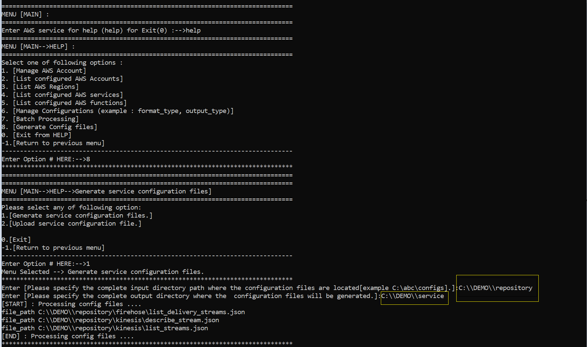

Resource lister consolidate functional files into service files and format the json_response attribute according to tool's requirment and finally generate firehose.json and kinesis.json files in output directory

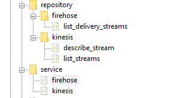

The output files structure is provided below just as a reference. You do not need to make any modifications to the output files.

**firehose.json**
```
{
    "service_name": "firehose",
    "functions": [
        {
            "function_name": "list_delivery_streams",
            "function_description": "list_delivery_streams ",
            "boto_session_type": "client",
            "response_format": "FORMAT_3",
            "function_type": "list",
            "is_regional": "Y",
            "pagination_support": "N",
            "is_multi_account_support": "Y",
            "implclass": "_regional_no_paginate",
            "implfunction": "process",
            "validation_functions": "",
            "result_keys": [
                "DeliveryStreamNames"
            ],
            "json_response": {
                "DeliveryStreamNames": "string"
            }
        }
    ]
}
```

**kinesis.json**
```
{
    "service_name": "kinesis",
    "functions": [
        {
            "function_name": "describe_stream",
            "function_description": "describe_stream ",
            "boto_session_type": "client",
            "response_format": "FORMAT_1",
            "function_type": "list",
            "is_regional": "Y",
            "pagination_support": "N",
            "is_multi_account_support": "N",
            "implclass": "_regional_no_paginate",
            "implfunction": "process",
            "validation_functions": "",
            "pagination_attributes": [
                {
                    "attribute_name": "StreamName",
                    "attribute_value": "",
                    "is_visible": "Y",
                    "display_prompt": "The name of the stream to describe.",
                    "type": "str"
                }
            ],
            "result_keys": [
                "StreamDescription"
            ],
            "json_response": {
                "StreamName": "",
                "StreamARN": "",
                "StreamStatus": "",
                "StreamModeDetails_StreamMode": "",
                "Shards_0_ShardId": "",
                "Shards_0_ParentShardId": "",
                "Shards_0_AdjacentParentShardId": "",
                "Shards_0_HashKeyRange_StartingHashKey": "",
                "Shards_0_HashKeyRange_EndingHashKey": "",
                "Shards_0_SequenceNumberRange_StartingSequenceNumber": "string",
                "Shards_0_SequenceNumberRange_EndingSequenceNumber": "string",
                "HasMoreShards": "",
                "RetentionPeriodHours": "",
                "StreamCreationTimestamp": "",
                "EnhancedMonitoring_0_ShardLevelMetrics_0": "",
                "EncryptionType": "",
                "KeyId": ""
            }
        },
        {
            "function_name": "list_streams",
            "function_description": "list_streams ",
            "boto_session_type": "client",
            "response_format": "FORMAT_2",
            "function_type": "list",
            "is_regional": "Y",
            "pagination_support": "Y",
            "is_multi_account_support": "Y",
            "implclass": "_regional_paginate",
            "implfunction": "process",
            "validation_functions": "",
            "result_keys": [
                "StreamSummaries"
            ],
            "json_response": {
                "StreamName": "",
                "StreamARN": "",
                "StreamStatus": "",
                "StreamModeDetails_StreamMode": "",
                "StreamCreationTimestamp": ""
            }
        }
    ]
}
```

## Step 4: Upload the Service Configuration files to Resource Lister

We will upload the service configuration files to the Resource Lister one at a time. First, we will upload the kinesis.json file. After that is complete, we will repeat the same upload process for the firehose.json file.

Go to Resource Lister --> Help-->8[Generate Config Files]-->2[Upload service configuration file.] 
Enter Input path  : Complete service configuration.json file path 

Note : 

**For Linux/Mac Path seperator is /**

Example 
/home/environment/services/kinesis.json

**For Windows Pather seperate is \\\\**

C:\\\DEMO\\\service\\\kinesis.json

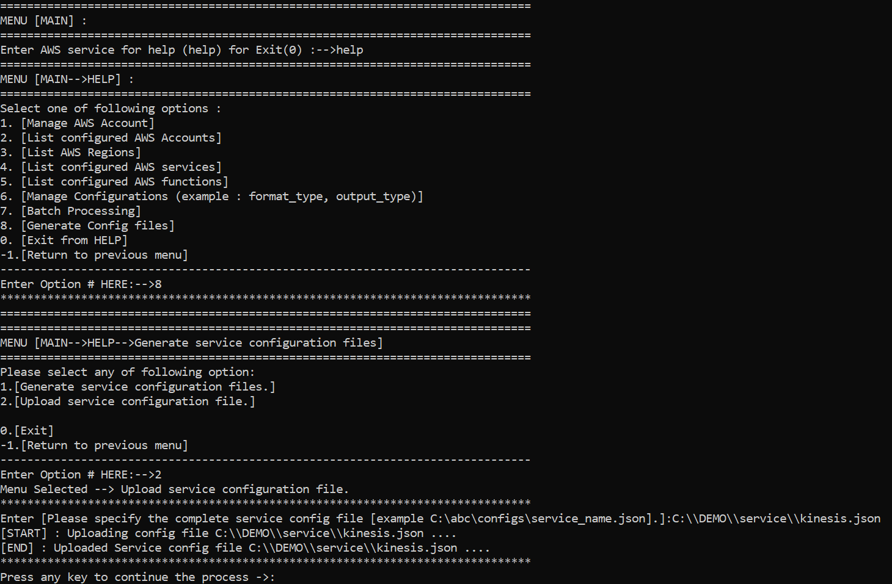

Repeat the same Upload process for firehose.json 

## Step 5: Test the Utility for New capabilities

Lets quickly check if these services are already supported in Resource Lister. You can do this by typing ENTER in the MAIN Menu.You will Notice now that Kinesis stream and Kinesis firehose are listed.


<p align="center">
  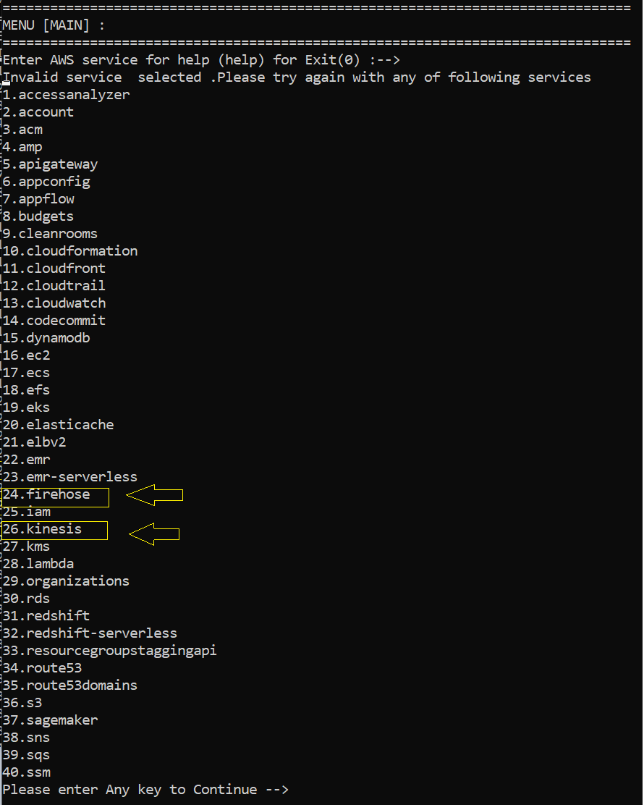


To view the newly configured Kinesis functions, go to the Main Menu and enter "kinesis". The Resource Lister will then display the new functions.
1.  describe_stream 2. list_streams

<p align="center">
  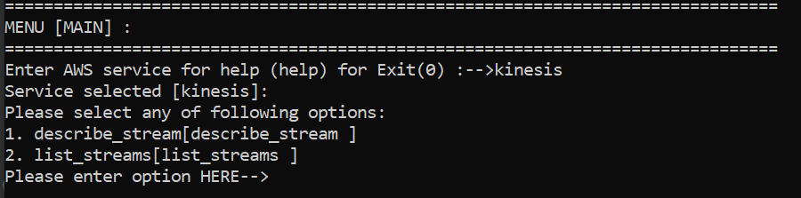


You can now generate a list of Kinesis streams across accounts and regions without writing any code by selecting the list_streams option (option 2).
<p align="center">
  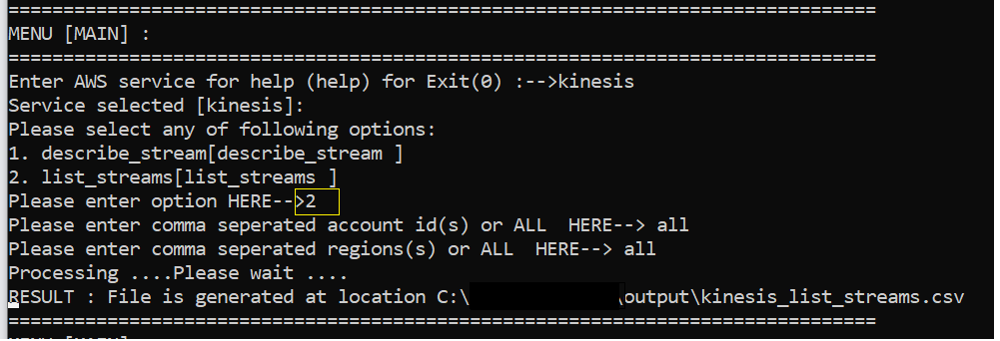


Similary can now generate a list of Firehose Delivery streams across accounts and regions without writing any code by selecting the firehose service and list_delivery_streams option
<p align="center">
  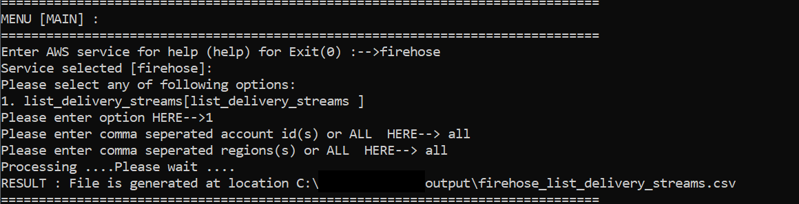

## Congratulations! You have successfully added new services to the Resource Lister.


